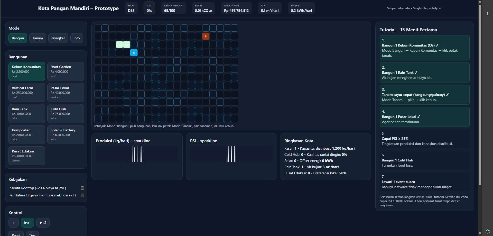

# Kota Pangan Mandiri – Prototype
# Project ini berbasis (Vite + React + Tailwind)
# Kalau command npm tidak bisa, install pakai: winget install OpenJS.NodeJS.LTS

## Jalankan lokal
```bash
npm install
npm run dev
```
Buka URL yang muncul (biasanya `http://localhost:5173`).

## Build produksi
```bash
npm run build
npm run preview
```

## Struktur
- `index.html` — entry Vite (wajib ada)
- `src/main.jsx` — bootstrap React
- `src/App.jsx` — kode prototipe game
- `tailwind.config.js`, `postcss.config.js`, `src/index.css` — Tailwind
